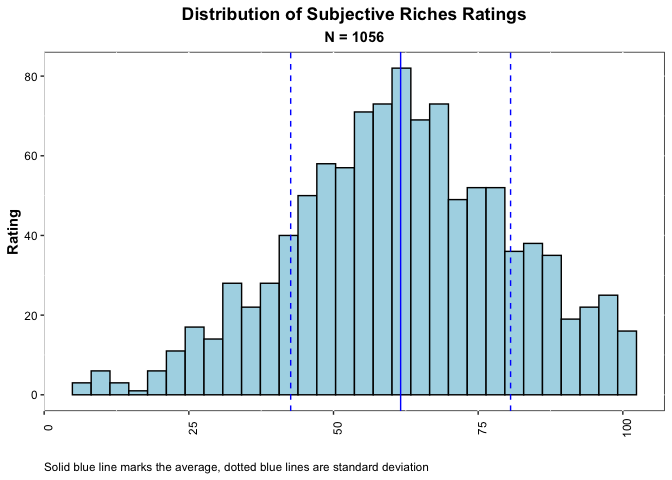
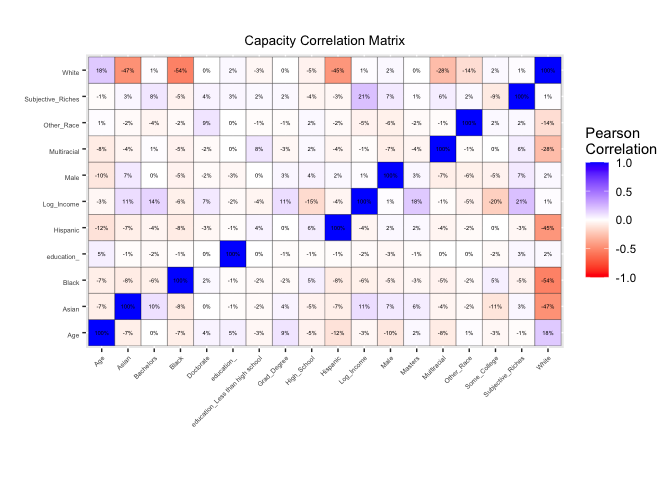
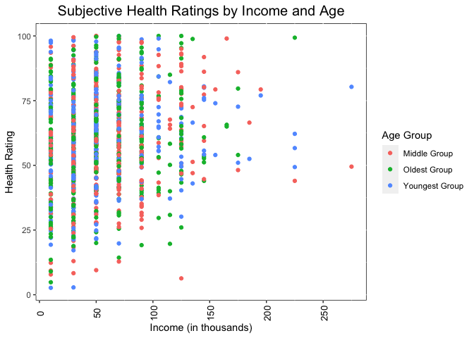

### I. Load Ratings Data

We start the project by loading in the ratings data and verifying the shape of the data. This data will be the basis of our
analysis. To ensure everything looks good, we will verify the number of observations, variables, and unique respondents in 
the data.


```
## [1] "There are 18189 observations, 4 variables, and 1056 unique respondents in the Ratings dataset."
```

### II. Duplicate Cleaning

Before running analysis on the ratings survey file, it was important to review any duplicates in the data. There appears
to have been 257 set of duplicates. For each set of duplicates, there were no more than two observations. I have removed
the dupliucates by selecting only the first response for a particular worker and aspect. 


### III. Analysis of Subjective Riches

Subjective riches is a summary metric used to describe the overall satisfaction of a respondent with each of the aspects
referred to in the survey. It was calculated by averaging the ratings given to all aspects for a given individual. The 
table below gives an overview of the spread of subjective riches in the data set. The average and median ratings are about
61, although they range from a little over 5 to 100 across the 1056 individuals that responded. From the histogram, we can
see that the scores have a unimodal and bell-curve distribution, with the exception of the truncation right at a rating of 100 (the highest rating possible).

<table class=" lightable-classic" style="font-family: Cambria; width: auto !important; float: left; margin-right: 10px;border-bottom: 0;">
<caption><span style="font-size:20px">Subjective Riches Descriptive Statistics</span></caption>
 <thead>
  <tr>
   <th style="text-align:left;"> Statistic Name </th>
   <th style="text-align:left;"> Value </th>
  </tr>
 </thead>
<tbody>
  <tr>
   <td style="text-align:left;"> Number of Respondents </td>
   <td style="text-align:left;"> 1056 </td>
  </tr>
  <tr>
   <td style="text-align:left;"> Minimum </td>
   <td style="text-align:left;"> 5.8 </td>
  </tr>
  <tr>
   <td style="text-align:left;"> 25th Percentile </td>
   <td style="text-align:left;"> 49.1 </td>
  </tr>
  <tr>
   <td style="text-align:left;"> 50th Percentile </td>
   <td style="text-align:left;"> 61.4 </td>
  </tr>
  <tr>
   <td style="text-align:left;"> 75th Percentile </td>
   <td style="text-align:left;"> 75.1 </td>
  </tr>
  <tr>
   <td style="text-align:left;"> Maximum </td>
   <td style="text-align:left;"> 100 </td>
  </tr>
  <tr>
   <td style="text-align:left;"> Mean </td>
   <td style="text-align:left;"> 61.6 </td>
  </tr>
  <tr>
   <td style="text-align:left;"> Standard Deviation </td>
   <td style="text-align:left;"> 19 </td>
  </tr>
</tbody>
<tfoot>
<tr><td style="padding: 0; " colspan="100%">
<sup>a</sup> Subjective Riches is calculated using the average rating  17 aspects</td></tr>
<tr><td style="padding: 0; " colspan="100%">
<sup>b</sup> These descriptive statistics are based on a sample of 1056 respondants</td></tr>
</tfoot>
</table>




### IV. Load Demographic Data

Before proceeding to the regression analysis, we will need to combine the demographic data and the subjective
riches data. We can see that the dataset has 1056 unique respondents, just as we saw in the ratings data set. There are 
1056 observations, which implies that each unique respondent has only one observation. We also have six variables in the
data set. From here we can feel comfortable merging our two data sets. 


```
## [1] "There are 1056 observations, 6 variables, and 1056 unique respondents in the Demographics dataset."
```


### V. Regression Analysis

To better understand the relationship between demographics and subjective riches, we will run two regressions. The first will be a simple
bivariate regression of subjective riches over income. The second will be a multivariate regression that will analyze the relationship
between income and subjective riches holding for age, gender, education, and race. Note that in both regressions I have converted income into the natural log of income. This helps to deal with issues of nonlinearity,and also improves interpretation. 

From the simple bivariate regression, we can see that income does have a significant positive relationship with subjective riches. A 
one percent increase in income is associated with a 0.0499 unit unit increase in the subjective riches rating. This relationship is 
significant at the 0.1% level. The size of the relationship is not necessarily very large. It implies that a 100% increase in income
would only increase subjective riches by about 5, compared to a standard deviation of 19. The intercept of the regression implies 
that an individual with no income would have, on average, a subjective riches rating of 8.19, although this is not very meaningful given
the smallest income in the data set is $10K. 

The multivariate regression gives surprisingly similar results, despite the addition of so many controls. I have only displayed the
coefficients that were statistically significant at at least the 5% level. This left only gender and income. Age, race, and education
were not significantly related to the subjective riches rating holding for other model factors, even after running join significance tests.

Despite the controls, the coefficient for log of income stayed very similar. In this regression, holding race, gender, age, education 
constant, a one percent increase in income is associated with a 0.0477 increase in the subjective riches rating. Once again, this 
coefficient is significant at the 0.1% level. We also see that gender has a significant relationship with the subjective riches rating. 
On average, men have a subjective riches rating that is 2.77 points higher than females of the same race, educational attainment, age,
and income. This relationship is significant at the 5% level. The fact that the coefficient stayed so consistent is a bit surprising, 
but may be due to the very low correlations between variables, as shown in the correlation matrix.

The slight decrease in the coefficient for log of income may have been due to the positive correlation between income and being male. 
Since males have higher incomes and higher subjective riches ratings on average, omitting it from the regression likely caused
a slight upward bias on the coefficient. From this analysis we can conclude that income is very likely related to subjective riches
ratings. However, the R-squared values of the first and second models are only .04 and .06 respectively. In other words, income only
explains about 4% of the variation in subjective riches. More analysis would be needed to better understand it.

If I were to be given household size, I might create a new variable that would be the income divided by the size of the household. This
would be done under the assumption that the respondent is the main money earner in the household, and might give a better idea of the 
financial resources available per person. I would add the household size as a control variable as well. 

<table style="NAborder-bottom: 0;border-bottom: 0; width: auto !important; margin-left: auto; margin-right: auto;" class="table">
<caption>Subjective Riches Regression</caption>
 <thead>
  <tr>
   <th style="text-align:left;">   </th>
   <th style="text-align:center;"> (Intercept) </th>
   <th style="text-align:center;"> Log_Income </th>
   <th style="text-align:center;"> Male </th>
  </tr>
 </thead>
<tbody>
  <tr>
   <td style="text-align:left;"> Model 1 </td>
   <td style="text-align:center;"> 8.192 </td>
   <td style="text-align:center;"> 4.994*** </td>
   <td style="text-align:center;">  </td>
  </tr>
  <tr>
   <td style="text-align:left;">  </td>
   <td style="text-align:center;"> (7.857) </td>
   <td style="text-align:center;"> (0.732) </td>
   <td style="text-align:center;">  </td>
  </tr>
  <tr>
   <td style="text-align:left;"> Model 2 </td>
   <td style="text-align:center;"> 25.436* </td>
   <td style="text-align:center;"> 4.779*** </td>
   <td style="text-align:center;"> 2.772* </td>
  </tr>
  <tr>
   <td style="text-align:left;">  </td>
   <td style="text-align:center;"> (12.468) </td>
   <td style="text-align:center;"> (0.777) </td>
   <td style="text-align:center;"> (1.179) </td>
  </tr>
</tbody>
<tfoot><tr><td style="padding: 0; " colspan="100%">
<sup></sup> + p &lt; 0.1, * p &lt; 0.05, ** p &lt; 0.01, *** p &lt; 0.001</td></tr></tfoot>
<tfoot><tr><td style="padding: 0; " colspan="100%">
<sup></sup> Only signficant coefficients displayed</td></tr></tfoot>
</table>


### V. Scatter Plot

If I were to create a scatter plot showing the relationship between subjective ratings of health, income, and age, I would do the following 
three steps:

1. I would create a health specific index by averaging together the ratings on health related aspects, such as:
  - the quality of your sleep
  - you not feeling anxious
  - your emotional stability
  - your health
  - your mental health
  - your physical fitness
  
2. I would then break age into quantiles - which will make the categories easier to visualize

4. I would also divide income by 1000 to report income in thousands, which might make the numbers easier to read

3. Finally, I would make my scatter plot by plotting income on the x-axis, subjective health on the y-axis, and would shade points
a specific color based on their age category, which might help to show age groupings. 





### VI. Conclusions

From both the regression analysis and the scatter plot, we can see that income plays a role in subjective well-being, but maybe not as large
a role as would have been expected. According to the regression model, gender also plays a role in determining subjective well-being. One of
the main conclusions I've drawn from this exercise is how much we cannot explain about variations in subjective well-being. Even with the 
multivariate regression, only about 6% of the variation in subjective well-being. 

There might be a few reasons that we are not seeing results. One reason might be specification. For instance, income may have differing 
impacts for different groups. Including interactions with gender, age, race, or education variables might allow for a more robust
understanding of the relationship between income and subjective well-being. 

Another issue might be how we are defining subjective well-being. In the subjective wellness metric, we are combining ratings for a pretty
wide array of aspects. It could certain demographic attributes apply to some aspects and not others, or to different aspects in different
ways. To some extent this was addressed in the scatter plot by focusing on health specific questions, but even this grouping was done
somewhat subjectively. One solution might be to run exploratory factor analysis on the aspect ratings. That might help us to find
underlying groupings based on the covariance in the data. Then we could focus on regressions of demographics on these specific groupings,
which might yield better results. 

The last issue is just how the survey itself was collected. Not very much context was given around how to rate aspects. Due to its 
subjective nature, people may not always answer in the same way. A 70 to one person may be equivalent to another person's 50. It might
be helpful to use more objective questions, especially around health and anxiety. "How many days in the past week did you have difficulty
sleeping?" for instance might be a clearer way to get at the "quality of your sleep" aspect.


  
